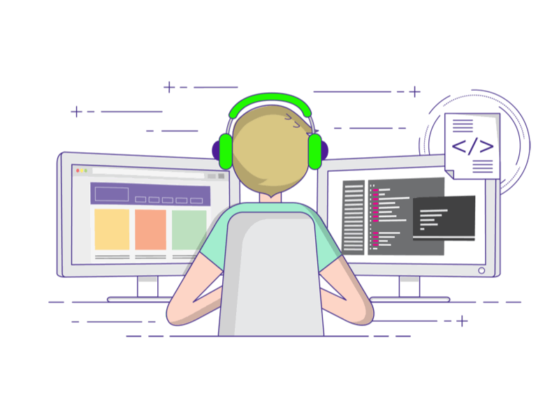

# 👋 Hi, I'm Ahsan Riaz

### Senior Python Full Stack Developer | AI/LLM & RAG | SaaS | Automation

I’m a **Senior Python Full Stack Developer with 5+ years of experience** building scalable web applications, SaaS platforms, AI-powered products, automation systems, and production-ready APIs.

I specialize in turning business requirements into **reliable, scalable, production-ready software** using Python, Django, FastAPI, React, PostgreSQL, MongoDB, AWS, and modern AI technologies.

### 💡 What I Build

* 🤖 **AI & LLM Applications** — AI assistants, RAG systems, document Q&A, AI automation, OpenAI integrations, and intelligent workflows
* 🚀 **SaaS Platforms** — Multi-tenant applications, subscription systems, dashboards, RBAC, APIs, and scalable backend architectures
* 🐍 **Python Backend Systems** — Django, Django REST Framework, FastAPI, Flask, REST APIs, WebSockets, background jobs, and third-party integrations
* ⚛️ **Full Stack Applications** — React, JavaScript/TypeScript, Tailwind CSS with Python-based backends
* 🔄 **Automation & Integrations** — API integrations, webhooks, workflow automation, data pipelines, and business process automation
* 🕷️ **Web Scraping & Data Engineering** — Scrapy, Selenium, Playwright, proxy systems, scheduled crawlers, and large-scale data processing
* ☁️ **Cloud & DevOps** — AWS, Docker, CI/CD, GitHub Actions, EC2, S3, SQS, CloudWatch, and production deployments

### 🛠️ Tech Stack

**Languages:**
Python · JavaScript · TypeScript · SQL

**Backend:**
Django · Django REST Framework · FastAPI · Flask · SQLAlchemy · Alembic

**Frontend:**
React · Vue.js · Next.js · Tailwind CSS

**AI / LLM:**
OpenAI · RAG · LangChain · LlamaIndex · Vector Search · FAISS · Pinecone · Qdrant · AI Automation

**Databases & Search:**
PostgreSQL · MySQL · MongoDB · Redis · OpenSearch · Elasticsearch

**Automation & Scraping:**
Scrapy · Selenium · Playwright · BeautifulSoup · Celery · RabbitMQ

**Cloud & DevOps:**
AWS · Docker · GitHub Actions · EC2 · S3 · SQS · CloudWatch · Heroku · Netlify

### 🚀 Featured Work

#### ⚖️ AI Legal Platform

Built an AI-powered legal platform using **FastAPI, OpenAI, MySQL, MongoDB, SQLAlchemy, and AWS**.

* AI legal assistant with conversational history
* RAG-based document Q&A
* AI document generation with conditional clauses and placeholders
* PDF and Word document generation
* Analytics dashboard and user activity insights
* User feedback and AI response regeneration
* Secure authentication and user management
* Production deployment on AWS

#### 🛒 Large-Scale Price Comparison Platform

Built a marketplace price comparison system processing **800K+ product records** across multiple marketplaces.

* Scrapy-based product data collection
* Selenium for dynamic websites
* FastAPI APIs and scheduling
* OpenSearch for high-performance product search
* AWS S3 logging
* Automated Buy Box monitoring
* Slack notifications and monitoring
* Data processing and product normalization

#### 🤖 AI Chatbots & Automation

Developed AI-powered assistants and automation systems using:

**Python · FastAPI · Django · OpenAI · RAG · Redis · WebSockets · REST APIs**

Built solutions involving conversational AI, document Q&A, third-party API integrations, automated workflows, and business process automation.

### 📈 Engineering Focus

I focus on building software that is:

* Scalable and maintainable
* Production-ready
* Secure and reliable
* Performance-oriented
* Easy to extend and maintain
* Well integrated with third-party services
* Designed around real business requirements

Areas I particularly enjoy working on include **Python backend architecture, AI integrations, RAG systems, SaaS products, APIs, automation, data-intensive applications, and cloud deployments.**

### 🤝 Who I Work With

I work with **startups, SaaS companies, founders, agencies, and businesses** that need experienced engineering support for:

**AI/LLM Development · RAG Applications · Python Backend Development · SaaS Development · API Development · Full Stack Development · Automation · Web Scraping · Data Pipelines · Third-Party Integrations · AWS Cloud Development**

Whether you are building a new product, adding AI capabilities to an existing application, scaling a backend system, or automating a manual workflow, I can help turn the requirements into a production-ready solution.

### 📫 Have a Project in Mind?

Feel free to reach out directly to discuss your project, technical requirements, or development needs.

* 📧 **Email:** [ahsan.m.riaz87004@gmail.com](mailto:ahsan.m.riaz87004@gmail.com)
* 💼 **LinkedIn:** [linkedin.com/in/ahsan-riaz9](https://www.linkedin.com/in/ahsan-riaz9/)
* 🌐 **Portfolio:** [ahsanriaz9.github.io](https://ahsanriaz9.github.io)
* 📅 **Book a 30-Minute Consultation:** [Schedule a call](https://calendly.com/ahsan-m-riaz87004/30min)

### 🚀 Let's Build Something Together

Whether you're building a new product, adding AI capabilities to an existing application, scaling a backend system, or automating a manual workflow, feel free to reach out.

⭐ **Explore my repositories, visit my portfolio, or book a consultation to discuss your project.**

